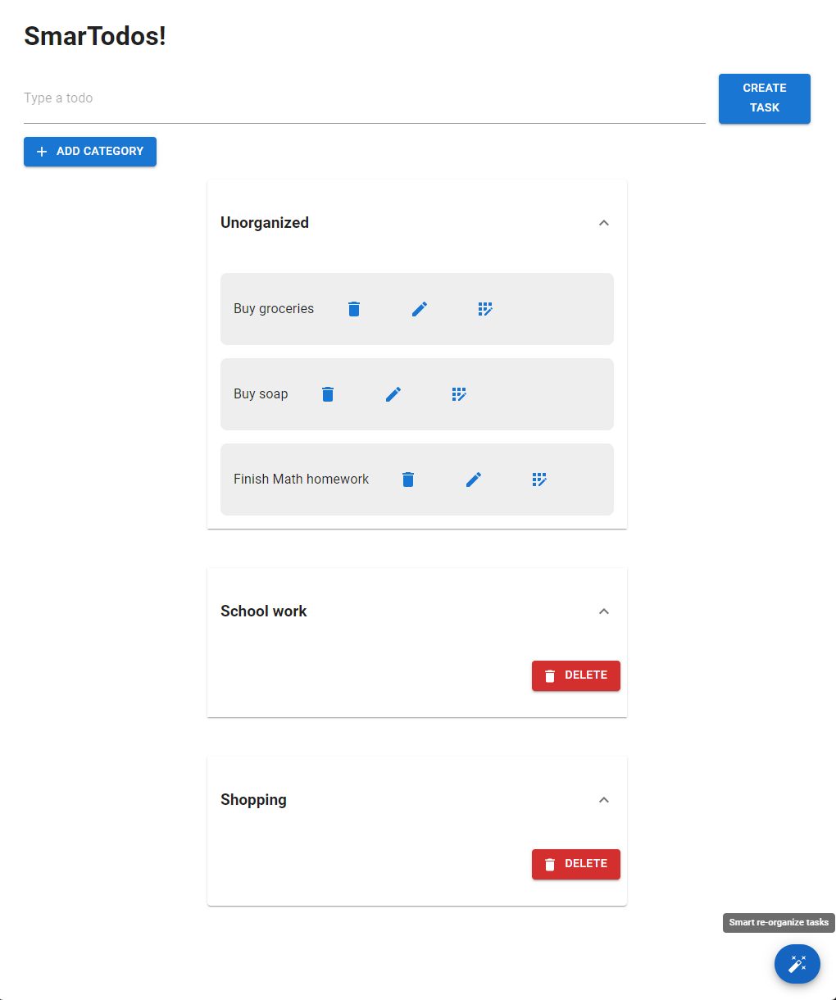
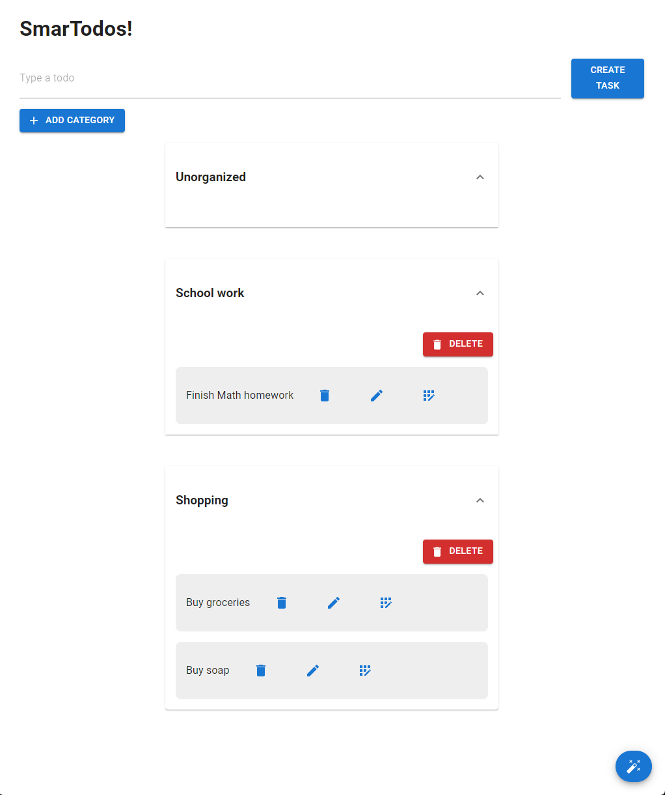

# MediaPipe Text Workshop

This project demonstrates the use of Google's MediaPipe Solutions for generating Text Embeddings to categorize tasks in a smart todo list app.

We will create an app that allows users to create tasks and automatically categorizes them into matching categories using the MediaPipe framework. The universal sentence encoder model is used to generate text embeddings for the tasks, which are then compared using cosine similarity to determine the most relevant category.

## Dependencies:
- : A JavaScript library for building user interfaces.
- : A popular React UI framework for creating modern and responsive user interfaces.
- : A framework developed by Google for building multimodal machine learning pipelines. This app utilizes the universal sentence encoder model provided out-of-the-box by Google with [`MediaPipe Solution for Text Embedding`](https://developers.google.com/mediapipe/solutions/text/text_embedder) for task categorization based on cosine similarity.

## Features
- Task creation: Users can create new tasks with a title and description.
- Automatic categorization: The app uses the MediaPipe framework's universal sentence encoder model to categorize tasks based on their text embeddings.
- Cosine similarity: The app calculates the cosine similarity between task embeddings to determine the most relevant category.
- User interface: The frontend is built using React with Material UI components for a modern and intuitive user interface.

## Usage
1. Clone the repository.
2. Install the required dependencies by doing `npm install`.
3. Start the development server using `npm run start`, the browser should automatically open the app at `http://localhost:3000`.
4. Start creating tasks and categories. Then click on the magic floating action button to automatically categorize the tasks.

## Demo

### Before:

### After clicking "Smart re-organize tasks":

